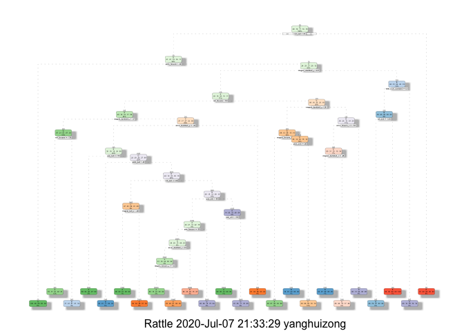

Overview
--------

One thing that people regularly do using the fitness devices is quantify
how much of a particular activity they do, but they rarely quantify how
well they do it. In this project, your goal will be to use data from
accelerometers on the belt, forearm, arm, and dumbell of 6 participants.
They were asked to perform barbell lifts correctly and incorrectly in 5
different ways.

The goal of this project is to predict the manner in which they did the
exercise. This is the “classe” variable in the training set by using
other variables.

Note: The data for this project come from this source:
<a href="http://web.archive.org/web/20161224072740/http:/groupware.les.inf.puc-rio.br/har" class="uri">http://web.archive.org/web/20161224072740/http:/groupware.les.inf.puc-rio.br/har</a>.

Load the Packages and Data
--------------------------

    library(caret)

    ## Loading required package: lattice

    ## Loading required package: ggplot2

    library(rpart)
    library(rpart.plot)
    library(RColorBrewer)
    library(rattle)

    ## Warning: package 'rattle' was built under R version 3.6.2

    ## Loading required package: tibble

    ## Loading required package: bitops

    ## Rattle: A free graphical interface for data science with R.
    ## Version 5.4.0 Copyright (c) 2006-2020 Togaware Pty Ltd.
    ## Type 'rattle()' to shake, rattle, and roll your data.

    library(randomForest)

    ## randomForest 4.6-14

    ## Type rfNews() to see new features/changes/bug fixes.

    ## 
    ## Attaching package: 'randomForest'

    ## The following object is masked from 'package:rattle':
    ## 
    ##     importance

    ## The following object is masked from 'package:ggplot2':
    ## 
    ##     margin

    #library(corrplot)
    library(gbm)

    ## Loaded gbm 2.1.5

    train <- read.csv('./pml-training.csv', header=T)
    dim(train)

    ## [1] 19622   160

    test <- read.csv('./pml-testing.csv', header=T)
    dim(test)

    ## [1]  20 160

Data Preprocessing
------------------

First, we remove the variables with missing values

    #colSums(is.na(train))
    #colSums(is.na(test))

    # remove variables that are mostly NA
    nulls <- sapply(train, function(x) mean(is.na(x))) > 0.95
    training <- train[, nulls==FALSE]
    testing  <- test[, nulls==FALSE]
    dim(training)

    ## [1] 19622    93

    dim(testing)

    ## [1] 20 93

Since the first 7 columns are irrelevant so we can delete them

    training <- training[, -c(1:7)]
    dim(training)

    ## [1] 19622    86

    testing <- testing[, -c(1:7)]
    dim(testing)

    ## [1] 20 86

Remove variables with Nearly Zero Variance

    NZV <- nearZeroVar(training)
    training <- training[, -NZV]
    testing  <- testing[, -NZV]
    dim(training)

    ## [1] 19622    53

    dim(testing)

    ## [1] 20 53

Then we can split the training dataset into 75% training out model and
25% of testing

    set.seed(2020) 
    inTrain <- createDataPartition(training$classe, p = 0.75, list = FALSE)
    trainData <- training[inTrain, ]
    testData <- training[-inTrain, ]
    dim(trainData)

    ## [1] 14718    53

    dim(testData)

    ## [1] 4904   53

Model Building
--------------

For this project, we will use classification trees to build a basic
model and then will use random forest to see if the results improved.

Classification Trees
====================

    #fit decision tree model with all the variables
    set.seed(2020)
    mod1 <- rpart(classe ~ ., data=trainData, method="class")
    fancyRpartPlot(mod1)

    ## Warning: labs do not fit even at cex 0.15, there may be some overplotting

    # make predictions on Test dataset
    predmod1 <- predict(mod1, newdata=testData, type="class")
    confMatmod1 <- confusionMatrix(predmod1, testData$classe)
    confMatmod1

    ## Confusion Matrix and Statistics
    ## 
    ##           Reference
    ## Prediction    A    B    C    D    E
    ##          A 1260  127   11   34   13
    ##          B   48  522   39   67   58
    ##          C   36  105  692  126  109
    ##          D   22   71   54  506   59
    ##          E   29  124   59   71  662
    ## 
    ## Overall Statistics
    ##                                           
    ##                Accuracy : 0.7427          
    ##                  95% CI : (0.7302, 0.7548)
    ##     No Information Rate : 0.2845          
    ##     P-Value [Acc > NIR] : < 2.2e-16       
    ##                                           
    ##                   Kappa : 0.6743          
    ##                                           
    ##  Mcnemar's Test P-Value : < 2.2e-16       
    ## 
    ## Statistics by Class:
    ## 
    ##                      Class: A Class: B Class: C Class: D Class: E
    ## Sensitivity            0.9032   0.5501   0.8094   0.6294   0.7347
    ## Specificity            0.9473   0.9464   0.9071   0.9498   0.9293
    ## Pos Pred Value         0.8720   0.7112   0.6479   0.7107   0.7005
    ## Neg Pred Value         0.9610   0.8976   0.9575   0.9289   0.9396
    ## Prevalence             0.2845   0.1935   0.1743   0.1639   0.1837
    ## Detection Rate         0.2569   0.1064   0.1411   0.1032   0.1350
    ## Detection Prevalence   0.2947   0.1497   0.2178   0.1452   0.1927
    ## Balanced Accuracy      0.9253   0.7482   0.8582   0.7896   0.8320

Random Forest
=============

    # fit random forest model with all the variables with 3 cross-validations
    set.seed(2020)
    controlRF <- trainControl(method="cv", number=3, verboseIter=FALSE)
    mod2 <- train(classe ~ ., data=trainData, method="rf", trControl=controlRF)
    mod2$finalModel

    ## 
    ## Call:
    ##  randomForest(x = x, y = y, mtry = param$mtry) 
    ##                Type of random forest: classification
    ##                      Number of trees: 500
    ## No. of variables tried at each split: 27
    ## 
    ##         OOB estimate of  error rate: 0.64%
    ## Confusion matrix:
    ##      A    B    C    D    E class.error
    ## A 4180    2    2    0    1 0.001194743
    ## B   21 2819    7    1    0 0.010182584
    ## C    0   12 2548    7    0 0.007401636
    ## D    0    1   25 2385    1 0.011194030
    ## E    0    1    5    8 2692 0.005173688

    # prediction on Test dataset
    predmod2 <- predict(mod2, newdata=testData)
    confMatmod2 <- confusionMatrix(predmod2, testData$classe)
    confMatmod2

    ## Confusion Matrix and Statistics
    ## 
    ##           Reference
    ## Prediction    A    B    C    D    E
    ##          A 1394    8    0    0    0
    ##          B    0  938    0    0    0
    ##          C    0    3  852    8    0
    ##          D    0    0    3  795    0
    ##          E    1    0    0    1  901
    ## 
    ## Overall Statistics
    ##                                           
    ##                Accuracy : 0.9951          
    ##                  95% CI : (0.9927, 0.9969)
    ##     No Information Rate : 0.2845          
    ##     P-Value [Acc > NIR] : < 2.2e-16       
    ##                                           
    ##                   Kappa : 0.9938          
    ##                                           
    ##  Mcnemar's Test P-Value : NA              
    ## 
    ## Statistics by Class:
    ## 
    ##                      Class: A Class: B Class: C Class: D Class: E
    ## Sensitivity            0.9993   0.9884   0.9965   0.9888   1.0000
    ## Specificity            0.9977   1.0000   0.9973   0.9993   0.9995
    ## Pos Pred Value         0.9943   1.0000   0.9873   0.9962   0.9978
    ## Neg Pred Value         0.9997   0.9972   0.9993   0.9978   1.0000
    ## Prevalence             0.2845   0.1935   0.1743   0.1639   0.1837
    ## Detection Rate         0.2843   0.1913   0.1737   0.1621   0.1837
    ## Detection Prevalence   0.2859   0.1913   0.1760   0.1627   0.1841
    ## Balanced Accuracy      0.9985   0.9942   0.9969   0.9940   0.9998

Make Predictions on the 20 different test cases
-----------------------------------------------

Since our random forest model has a higher accuracy score, we will will
random forest on the test dataset

    predictTEST <- predict(mod2, newdata=testing)
    predictTEST

    ##  [1] B A B A A E D B A A B C B A E E A B B B
    ## Levels: A B C D E
